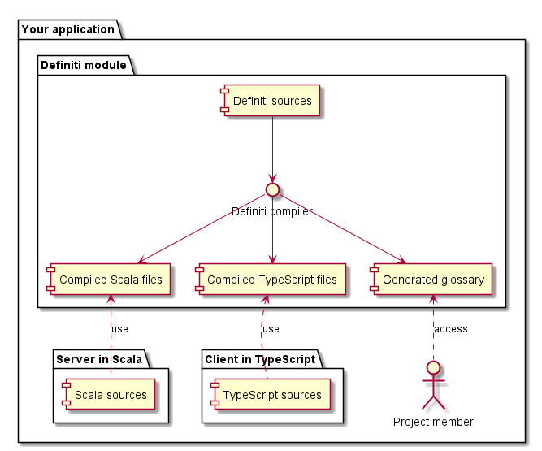

# Definiti

## Describe your domain

Does your language enable you to describe your domain? Does it only describe you domain or do technical stuffs are in your way?

The objective of **Definiti** is to provide a declarative language and tools to help you describe your domain and throw out technical code at the edge of your application.

## How does it work?

Define all your domain logic in **Definiti** language, then generate sources code in your technical languages such as Scala or Typescript.

It is also possible to generate other things than sources files, as glossary, plantUML diagrams and more.

The following diagram represents a simple workflow with **Definiti**:




**Definiti** is not intended to work as a standalone language. Please check which languages are supported before using it.


## Getting started


We use [nut](https://github.com/matthieudelaro/nut) to download and execute the **Definiti** compiler. Please refers to the documentation to install it on your environment.


To start using **Definiti**, create a `nut.yml` file:



```yaml

syntax_version: "7"project_name: nutdocker_image: definiti/definiti:0.3.0-SNAPSHOTmacros:  run:    usage: Run the compiler with configuration from `definiti.conf`volumes:  main:    host_path: .    container_path: /definiticontainer_working_directory: /definitiwork_in_project_folder_as: /definiti
```



Then, create the `definiti.conf` file \(we will explain it later\):



```text

definiti {  dependencies = [    # Core compiler version 0.3.0-SNAPSHOT    "io.github.definiti:core_2.12:0.3.0-SNAPSHOT",        # Scala files (model definition)    "io.github.definiti:scala-model_2.12:0.3.0-SNAPSHOT"  ]  api {    # Version of the API    version = "0.3.0-SNAPSHOT"  }  core {    # Where are definiti files located?    # Here, we use the same structure than maven.    source = "src/main/definiti"        # What generators should we use?    generators = [      # Scala model generator      "definiti.scalamodel.plugin.ScalaModelGeneratorPlugin"    ]        # Kept empty because not needed - describe further    parsers = []    validators = []    flags = {}  }  # Specific configuration for scala-model plugin  scalamodel {    destination = "src/main/scala-definiti"  }}
```



Write your first **Definiti** file in `src/main/definiti/blog.def` \(we will come back to the syntax later\):



```text

package my.blog

type BlogArticle {
  title: String
  description: String
  date: Date
}
```



Then compile it:

```text
$ nut run
```

You will see a new directory: `src/main/scala-definiti` with the most interesting file `my/blog/blog.scala`:



```scala
package myimport definiti.native._import java.time.LocalDateTimepackage object blog {  case class BlogArticle(title: String, description: String, date: LocalDateTime)  object BlogArticle {    val verification: Verification[BlogArticle] = Verification.none[BlogArticle]  }}
```



You can now use it in your own project:



```scala
package my.app

import java.time.LocalDateTime
import my.blog.BlogArticle


object App {
  def main(args: Array[String]): Unit = {
    val firstArticle = BlogArticle(
      title = "My first article",
      description = "My description",
      date = LocalDateTime.now()
    )
    println(firstArticle)
  }
}
```



## What's next?

Please check the left panel to go through the documentation.

